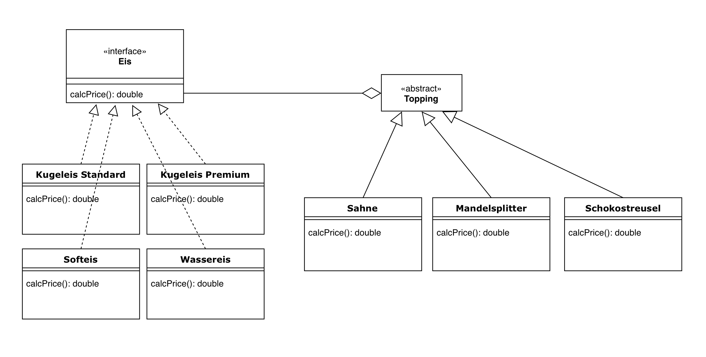
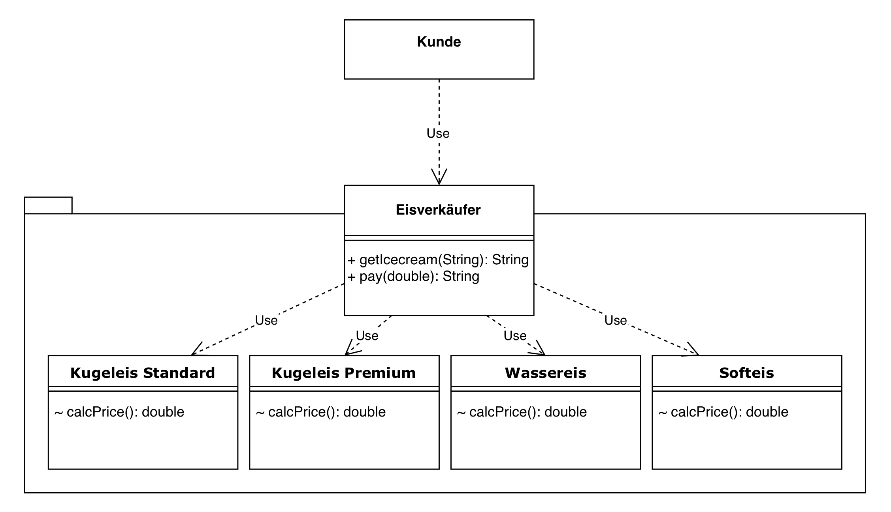

# INFO3: lab06

**Lotte Unckell** (565918), **Salomon Popp** (558834)

2019-06-19

GitHub Repository: https://github.com/lotteunckell/Informatik03

## 6.1 Decorator (Salomon Popp)

### Aufgabe

Eine Eisdiele möchte sein Angebot an Eis modellieren (Wassereis, Kugeleis, ...). Im Angebot gibt es 4 verschiedene Eisvariationen mit jeweils unterschiedlichem Preis. Jedes Eis kann mit Toppings verfeinert werden. Zur Auswahl stehen dabei Sahne (+1€), Mandelsplitter (+0,8€) und Schokostreusel (+0,5€).

Implementiert den im Klassendiagramm dargestellten Sachverhalt, welcher das Entwurfsmuster "Decorator" verwendet.



### Konzeption

Prinzipiell lässt sich das Decorator-Muster an vielen Szenarien gut demonstrieren, die Wahl eines geeigneten Beispiels war daher (nicht zuletzt aufgrund der sommerlichen Temperaturen) schnell gefunden. Gerade aufgrund der zahlreichen Variationen wird schnell ersichtlich, dass es eines Decorators benötigt, um die Struktur nicht unnötig kompliziert zu gestalten und um weiterhin gewährleisten zu können, dass nachträglich beliebig weitere Variationen hinzugefügt werden können.

### Implementierung

Wie im Klassendiagramm bereits ersichtlich wird, kommt unser Decorator bei der Auswahl der Toppings zum Einsatz.

In allen Klassen wird eine `calcPrice()` Methode implementiert. In den Toppings ruft diese zunächst `calcPrice()` bei dem aggregierten Basis-Eis auf und addiert anschließend den eigenen Aufpreis. Somit wird eine Verkettung nach folgendem Vorbild ermöglicht (Mehrfachauswahl bei den Toppings ebenfalls möglich):

```java
new Mandelsplitter(new KugeleisStandard()).calcPrice()
```


## 6.2 Fassade (Lotte Unckell)

Nun wollen Kunden dieses Eis auch Kaufen. Baut einen Eisverkäufer als Fassade ein, damit die Kunden nicht Kreuz und Quer über das Eis herfallen. Der Dekorierer kann hier auch weggelassen werden.



### Konzeption

Bei der Konzeption dieser Aufgabe habe ich versucht auf der ersten Aufgabe aufzubauen, um die gesamte Übung zusammenhängend zu gestalten. Ich habe mir ein Szenario überlegt, bei dem es notwendig wäre eine Fassade einzubauen. Da eine Fassade die Interaktion an mehreren Stellen zwischen Packages auf eine Stelle konzentriert war ein Szenario nötig, bei dem es genau darum geht. Da ist mir ein Eiswagen eingefallen, bei dem der Verkäufer als Fassade für den Kunden agiert, in dem er die bestellten Eissorten herausgibt, anstatt dass die Kunden sich das Eis selbst aus dem Wagen holen.

### Implementierung

Aufgrund dessen, dass die vier Klassen, die die verschiedenen Eissorten repräsentieren schon aus der vorherigen Aufgabe implementiert waren, war in diesen Klassen nicht mehr viel zu tun. Ich habe nur die Oberklasse entfernt. Dann habe ich die Klasse 'Main' implementiert in der ich eine Bestellung an die Klasse 'Eisverkäufer' übergeben und dann die `pay()` Methode getestet habe.

Die einzige Schwierigkeit, die ich bei der Implementation der Klasse 'Eisverkäufer' hatte, trat beim debuggen der `pay()` Methode auf. Als ich versuchte den noch zu zahlenden Betrag auszurechnen war das Ergebnis von 3.0-1.7 nicht wie erwartet 1.3, sondern 1.30000000002. Wie ich dann ergoogelt habe, hängt das mit dem Datentypen `double` zusammen. Daraufhin habe ich mich dazu entschlossen einfach auf zwei Stellen hinter dem Komma zu runden, da die Ungenauigkeiten so gering zu sein schienen, dass das ausreichend erschien.